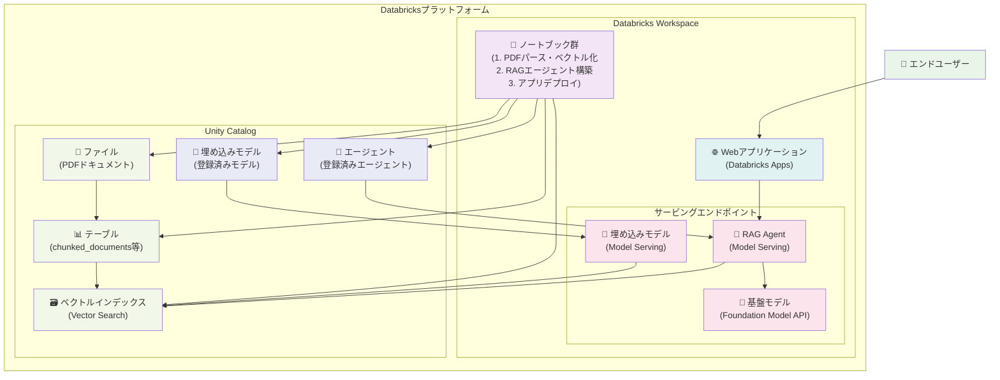

# databricks_rag_app_demo

## 概要

このプロジェクトは、DatabricksプラットフォームでRAG（Retrieval-Augmented Generation）アプリケーションを構築するためのデモワークショップです。PDFドキュメントのパース、ベクトルインデックスの作成、RAGエージェントの構築、そして最終的にWebアプリケーションのデプロイまでを一貫して学習できます。

## システム構成

本ワークショップで構築するRAGアプリケーションのシステム構成は以下の通りです：

### 主要コンポーネント

- **Unity Catalog**: データ・アセット管理基盤
  - ファイル（PDFドキュメント）の管理
  - テーブル（chunked_documents等）の管理
  - ベクトルインデックスの管理
  - 埋め込みモデル・エージェントの登録・管理
  
- **Databricks Workspace**: 開発・実行環境
  - ノートブック群（PDFパース〜アプリデプロイまでの一連の処理）
  - Webアプリケーション（Databricks Apps）
  - サービングエンドポイント（RAG Agent、埋め込みモデル、基盤モデル）

- **データフロー**: Unity Catalog内のアセットとWorkspace内のサービスが連携してRAGシステムを構成
- **全体基盤**: 全てのコンポーネントがDatabricksプラットフォーム上で完結

## 前提条件

### ワークスペース要件
このワークショップを実行するには、以下の機能が利用可能なリージョンのDatabricksワークスペースが必要です：

- **Databricks Apps**
- **Model Serving**
- **Vector Search**
- **Agent Framework**
- **Foundation Model API**

最新の対応状況については、リージョン限定の機能のドキュメント（[Azure](https://learn.microsoft.com/ja-jp/azure/databricks/resources/feature-region-support)/[AWS](https://docs.databricks.com/aws/ja/resources/feature-region-support)）をご確認ください。

### その他の要件
- Unity Catalogが有効化されたワークスペース
- 適切な権限を持つDatabricksアカウント

## 重要な注意事項

⚠️ **2025年7月時点で、このワークショップで使用される一部の機能はβ版です。**
- `ai_parse_document`関数

本番環境での使用前に、各機能の安定性とサポート状況をご確認ください。

## ファイル構成

### メインノートブック
このワークショップは3つのメインノートブックで構成されています：

1. **`1_PDFのパースとベクトルインデックスの作成.ipynb`**
   - PDFドキュメントの読み込みとテキスト抽出
   - テキストのチャンク化と前処理
   - Vector Searchを使用したベクトルインデックスの作成

2. **`2_RAGエージェントの構築.ipynb`**
   - Agent Frameworkを使用したRAGエージェントの実装
   - Model Servingエンドポイントとの連携
   - エージェントのテストと評価

3. **`3_Webアプリケーションのデプロイ.ipynb`**
   - Databricks Appsを使用したWebアプリケーションのデプロイ
   - ユーザーインターフェースの設定
   - アプリケーションの公開と管理

### サポートファイル

#### `input/`
サンプルPDFドキュメントが格納されているディレクトリ：
- `agent_system_design_pattern.pdf` - エージェントシステム設計パターン
- `genai_developver_workflow.pdf` - 生成AI開発ワークフロー

#### `streamlit_chatbot_sample/`
Streamlitを使用したチャットボットアプリケーションのサンプル：
- `app.py` - メインアプリケーションファイル
- `app.yaml` - Databricks Apps設定ファイル
- `messages.py` - メッセージ処理ロジック
- `model_serving_utils.py` - Model Servingとの連携ユーティリティ
- `requirements.txt` - Python依存関係

#### その他
- `agent.py` - RAGエージェントの実装
- `databricks.yml` - Databricksプロジェクト設定
- `参考_日本語埋め込みモデルのデプロイ.ipynb` - 日本語対応の埋め込みモデル参考資料

## 使用方法

1. **準備**
   - 対応リージョンのDatabricksワークスペースを用意
   - Unity Catalog上における利用可能なカタログを準備

2. **ワークショップの実行**
   - ノートブック1から順番に実行
   - 各ステップで生成されるリソースを確認

3. **アプリケーションのデプロイ**
   - ノートブック3を参考にしながらWebアプリケーションをデプロイ

## 参考リンク

- [Databricks機能のリージョンサポート（Azure）](https://learn.microsoft.com/ja-jp/azure/databricks/resources/feature-region-support)
- [Databricks機能のリージョンサポート（AWS）](https://docs.databricks.com/aws/ja/resources/feature-region-support#model-serving-aws)
- [Databricks Apps ドキュメント](https://docs.databricks.com/en/dev-tools/databricks-apps/index.html)
- [Agent Framework ドキュメント](https://docs.databricks.com/en/generative-ai/agent-framework/index.html)